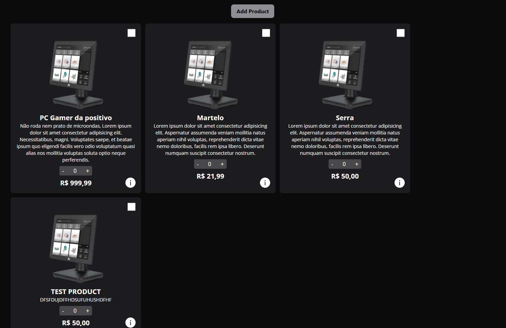

## Instalação
primeiro, renomeia a pasta do projeto para não incluir espaços no nome pois o next não funciona com 

```bash
npm i
npx prisma migrate dev
```

## Como Rodar?
```bash
npm run dev
# or
yarn dev
```

Open [http://localhost:3000](http://localhost:3000) with your browser to see the result.

# Enunciado

O projeto será um protótipo de site e-commerce, com três telas:
### Listagem de produtos
---


Esta página será a home, localizada na rota `/`, arquivo `index.tsx`, consiste em uma iteração do componente pronto de produtos que já desenvolvemos em outros exercícios, os dados dos produtos vão vir através das `props` da página, onde será buscado por um endpoint da nossa API, o `GET /api/products`.

A maneira de buscar estes dados e ao mesmo tempo esperar para renderizar a página somente quando tiver os dados prontos é ataravés da função especial do next, o `getServerSideProps`.

Além da listagem, tem um botão que gera um produto para testar. Esse substitui o formulário que será implementado na próxima aula.

Façam uma modificação no componente de produtos para podermos navegar para a página de detalhes passando o id, utilize o componente `<Link href=...>` do next e um ícone da biblioteca ant desing `<InfoCircleFilled>` para servir de elemento clickável

### Detalhes do produto 
---


Esta página será a página detalhada do produto, localizada na rota dinâmica `/product/id`, arquivo `/product/[id].tsx`, consiste na listagem de todas as informações básicas do produto e mais a parte detalhada, tudo isso esta no tipo `DetailedProduct`. Essa tela terá duas interações do usuário, o botão utilizando o ícone `<LeftCircleFilled>` com o link para a home e o botão de deleção do produto, utilizando o ícone `<LeftCircleFilled>` e chamando o método `remove(/removeProduct?id=)` para deletar o produto. Após a deleção do produto, precisaremos redirecionar o usuário para a página home ataravés do método `Router.push('/')`.

Além das interações e display das informações, precisará ser quebrado em componentes essas três secções:

* Especificações


* Avaliações


* Score


### Formulário de inserção de produto
---
Será feito na próxima aula